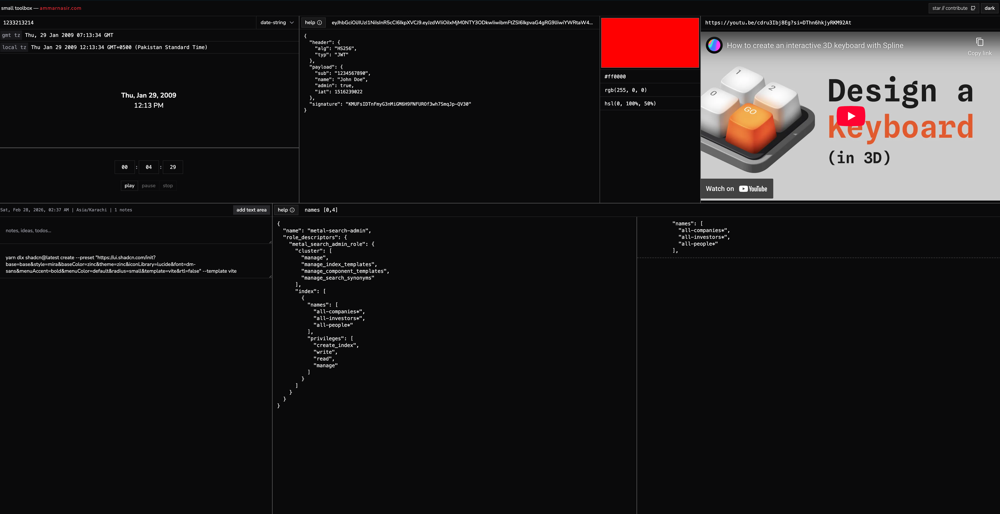

# rawgrid

A browser-based developer toolbox with multiple utilities arranged in a resizable grid layout. All tools run entirely client-side with persistent state across sessions.

**[Live](https://fanoflix.github.io/rawgrid-client/)**



## Tools

| Tool                  | Description                                                                                                               | Example Use Case                                                                                                                         |
| --------------------- | ------------------------------------------------------------------------------------------------------------------------- | ---------------------------------------------------------------------------------------------------------------------------------------- |
| **Unix Timestamp**    | Convert Unix timestamps to human-readable dates in GMT and local timezone. Supports date-string, ISO, and locale formats. | Paste `1516239022` from a server log and instantly see `Thu, Jan 18, 2018 12:30:22 PM` in your local timezone.                           |
| **JWT Decoder**       | Decode JSON Web Tokens into their header, payload, and signature components.                                              | Paste a JWT from an API response to inspect its claims, expiry (`exp`), and signing algorithm without leaving the browser.               |
| **Color Picker**      | Pick a color and view its value in HEX, RGB, and HSL formats with one-click copy.                                         | Grab the exact `hsl()` value of a color from a design mockup to use in your CSS.                                                         |
| **Timer**             | Countdown timer with play, pause, and stop controls. Plays a sound on completion.                                         | Set a 5-minute timer for a quick break or to time-box a debugging session.                                                               |
| **YouTube Player**    | Embed and play YouTube videos by URL or video ID using privacy-enhanced mode.                                             | Keep a tutorial video playing in one panel while coding in another window.                                                               |
| **Stacked Textareas** | Up to 3 resizable note areas with text transforms (capitalize, uppercase, lowercase).                                     | Jot down quick notes, API keys, or scratch text while working across other tools.                                                        |
| **JSON Search**       | Search large JSON documents for specific fields with configurable context lines. Uses a Web Worker for files over 250KB.  | Query `names, privileges [0,4]` against an Elasticsearch role mapping JSON to extract just the fields you need with surrounding context. |

## Getting Started

### Prerequisites

- [Node.js](https://nodejs.org/) (v18+)
- npm, yarn, or pnpm

### Installation

```bash
git clone https://github.com/Fanoflix/rawgrid-client.git
cd rawgrid-client
npm install
```

### Development

```bash
npm run dev
```

### Build

```bash
npm run build
npm run preview
```

## Tech Stack

- **React 19** with TypeScript
- **Vite** for builds and HMR
- **Tailwind CSS 4** with OKLCH color theming
- **shadcn/ui** components
- **react-resizable-panels** for the grid layout
- **IndexedDB** (via `idb`) for persistent tool state

## Contributing

Contributions are welcome! Feel free to open an issue or submit a pull request.

1. Fork the repository
2. Create your feature branch (`git checkout -b feature/my-feature`)
3. Commit your changes (`git commit -m 'Add my feature'`)
4. Push to the branch (`git push origin feature/my-feature`)
5. Open a Pull Request

## License

This project is open source. See the repository for license details.

## Author

**Ammar Nasir** — [ammarnasir.com](https://ammarnasir.com)
