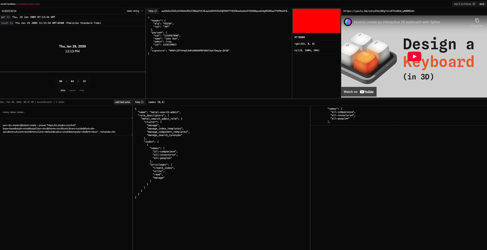

# rawgrid

A browser-based developer toolbox with multiple utilities arranged in a resizable grid layout. All tools run entirely client-side with persistent state across sessions.

**[Live](https://fanoflix.github.io/rawgrid-client/)**



## Tools

| Tool                  | Description                                                                                                                                             | Example Use Case                                                                                                                         |
| --------------------- | ------------------------------------------------------------------------------------------------------------------------------------------------------- | ---------------------------------------------------------------------------------------------------------------------------------------- |
| **Unix Timestamp**    | Convert Unix timestamps to human-readable dates in GMT and local timezone. Supports date-string, ISO, and locale formats.                               | Paste `1516239022` from a server log and instantly see `Thu, Jan 18, 2018 12:30:22 PM` in your local timezone.                           |
| **JWT Decoder**       | Decode JSON Web Tokens into header, payload, and signature. Edit the decoded JSON and hit `confirm edits` to rebuild the token.                         | Paste a JWT from an API response to inspect its claims, or change `exp` and rebuild the token for a local test.                          |
| **Color Picker**      | Pick a color and edit it as HEX, RGB, HSL, HWB, OKLCH, or OKLAB. Editing any value updates all the others.                                              | Paste an `oklch()` value from a design system and grab its HEX for an older stylesheet.                                                  |
| **Timer**             | Countdown timer with presets, a progress bar, and a choice of alarm sounds (clacker, thock, clicky, button).                                            | Set a 25-minute timer to time-box a debugging session.                                                                                   |
| **Video Player**      | Play a local video file by dropping it in or browsing (mp4, webm, ogg, mov, mkv, avi). Hidden by default.                                               | Replay a screen recording of a bug while writing the reproduction steps.                                                                 |
| **YouTube Player**    | Embed and play YouTube videos by URL or video ID using privacy-enhanced mode.                                                                           | Keep a tutorial video playing in one panel while coding in another window.                                                               |
| **Stacked Textareas** | Any number of resizable, scrollable note areas with text transforms (capitalize, uppercase, lowercase) and adjustable font size.                        | Jot down quick notes, API keys, or scratch text while working across other tools.                                                        |
| **Base64**            | Encode text to Base64 and decode it back, with UTF-8 safe conversion and inline errors on invalid input.                                               | Paste a Base64 blob from a config file into the left box, hit `decode`, and read the plain text on the right.                            |
| **JSON Prettify**     | Format messy JSON with 2-space, 4-space, or tab indent. Minify, sort keys A-Z, and get line/column parse errors. Both panes are editable.                | Paste a one-line API response, read it indented, then hit `minify` to squash it back for a config file.                                  |
| **JSON Search**       | Search large JSON documents for specific fields with configurable context lines. Uses a Web Worker for files over 250KB.                                | Query `names, privileges [0,4]` against an Elasticsearch role mapping JSON to extract just the fields you need with surrounding context. |

## UX Features

- **Resizable grid**: drag the lines between spaces to resize them.
- **Edit spaces**: click `edit spaces` to rearrange the grid. Tools fade and the top bar turns red so edit mode is hard to miss.
  - **Drag to move**: drag any space onto another to swap them. The drag preview snaps to the target space's size.
  - **Hide spaces**: hide any space and the spaces around it grow to fill the room. Bring them back one at a time from the `hidden spaces` menu, or hit `Reset` for the default layout.
- **JSON editors**: the JWT decoder, JSON prettify, and JSON search use a code editor with syntax highlighting (One Dark Pro, One Light in light mode), bracket colors by depth, and indentation that follows the JSON structure.
- **Command palette**: press `Ctrl/Cmd + K` to run actions across tools, such as starting the timer, loading JSON, decoding a token, switching theme, or toggling edit mode.
- **Hover hints**: hovering a tool shows its name and description in the top bar.
- **Light and dark themes**: toggle from the top bar or the command palette.
- **Persistent state**: tool inputs, layout, hidden spaces, theme, and the chosen alarm sound are saved in the browser and restored on reload.
- **Copy buttons**: hover an output to copy it.

## Getting Started

### Prerequisites

- [Node.js](https://nodejs.org/) (v18+)
- npm, yarn, or pnpm

### Installation

```bash
git clone https://github.com/Fanoflix/rawgrid-client.git
cd rawgrid-client
npm install
```

### Development

```bash
npm run dev
```

### Build

```bash
npm run build
npm run preview
```

## Tech Stack

- **React 19** with TypeScript
- **Vite** for builds and HMR
- **Tailwind CSS 4** with OKLCH color theming
- **shadcn/ui** components
- **react-resizable-panels** for the grid layout
- **dnd-kit** for dragging spaces
- **CodeMirror 6** for the JSON editors
- **IndexedDB** (via `idb`) for persistent tool state

## Contributing

Contributions are welcome! Feel free to open an issue or submit a pull request.

1. Fork the repository
2. Create your feature branch (`git checkout -b feature/my-feature`)
3. Commit your changes (`git commit -m 'Add my feature'`)
4. Push to the branch (`git push origin feature/my-feature`)
5. Open a Pull Request

## License

This project is open source. See the repository for license details.

## Author

**Ammar Nasir** — [ammarnasir.com](https://ammarnasir.com)
